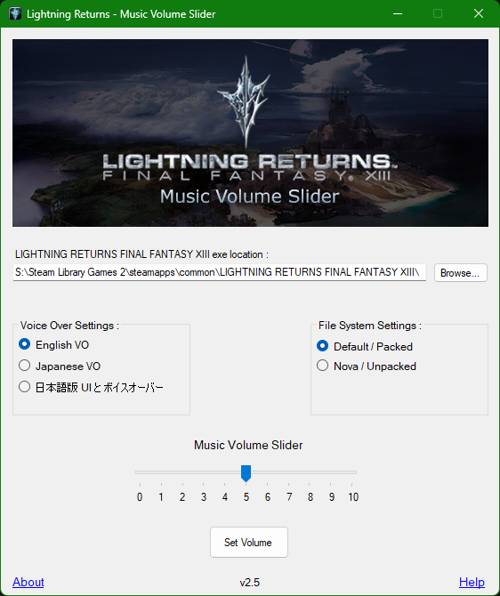

# LRMusicVolumeSlider
 
  
This is a small C# Winforms based GUI app that allows you to control the volume levels of the music in LIGHTNING RETURNS FINAL FANTASY XIII steam version of the game. please use the Help option available in the app for instructions on using this app.

**Important:** The ffxiiicrypt tool that is bundled with this app is required for decrypting the archive files of this game and the author of this ffxiiicrypt tool is Echelo from Xentax.

## For developers
The app code available here is the new updated codebase made just for this new version and you won't find the older version commits or the codebase for those versions here.

The following package is used for Zlib compression and decompression:
 **DotNetZip** - https://www.nuget.org/packages/DotNetZip
